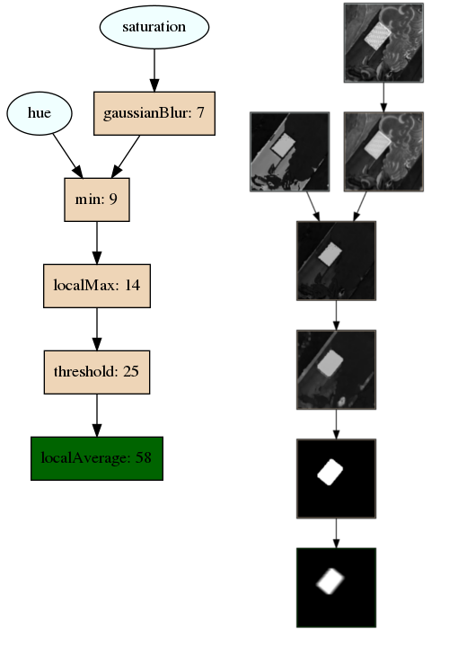

# CGPExperiments
This repository contains a framework for training [Cartesian Genetic Programs (CGPs)](https://en.wikipedia.org/wiki/Cartesian_genetic_programming). This framework allows for training on any sort of data, but has been primarily designed for image processing tasks. Here's a visualization of the type of modules you can train with this framework!



For a quick introduction on CGPs and the types of problems they can solve, [consult the corresponding blog post](http://www.mitchellspryn.com/2021/01/06/Cartesian-Genetic-Programming-For-Image-Processing.html). 

# Development workflow
To use this framework for development, you'll typically need to perform the following steps:

* **Write your basis functions**: For each basis function member, create a new class that extends the [Gene class](https://github.com/mitchellspryn/CGPExperiments/blob/master/core/include/Gene.hpp). Implement all of pure virtual methods. Consult the header for information about the purpose of each method. 
* **Write your fitness function**: Write your fitness function used to evaluate the fitness of each candidate by extending the [FitnessFunction class](https://github.com/mitchellspryn/CGPExperiments/blob/master/core/include/FitnessFunction.hpp). 
* **Implement the factory class wrappers**: You will need to extend the [FitnessFunctionFactory](https://github.com/mitchellspryn/CGPExperiments/blob/master/core/include/FitnessFunctionFactory.hpp) and [GeneFactory](https://github.com/mitchellspryn/CGPExperiments/blob/master/core/include/GeneFactory.hpp) to provide the framework with your new genes and fitness function. 
* **Modify the TrainCgp exe to use your new fitness function and basis functions**: Modify the [executable](https://github.com/mitchellspryn/CGPExperiments/blob/master/application/trainCgp.cpp). You could either hard-code it or use the "geneSet" member of the configuration to swap to the new genes. 
* **Create data files for your training and testing labels**: The framework expects your data files to be stored in a flat binary format. For examples on how to generate this, see [an example of generating a flat buffer](https://github.com/mitchellspryn/CGPExperiments/blob/master/application/generateCurve.cpp) or [an example of generating a collection of images](https://github.com/mitchellspryn/CGPExperiments/blob/master/dataGeneration/GenerateCardCgpImageDataset.ipynb)
* **Create the configuration file**: Using one of the [existing configuration files](https://github.com/mitchellspryn/CGPExperiments/blob/master/experiments/cardConfig.json) as an example, fill out the configuration file to design your experiment. For more documentation on the meaning of each element, see below. 

Two example genesets are included:
* **[Curve Fitting](https://github.com/mitchellspryn/CGPExperiments/tree/master/fitCurve)**: These genes contain simple arithmetic operations, such as addition and multiplication. This can be seen as a minimal example of how to implement a custom geneset.
* **[Image Processing](https://github.com/mitchellspryn/CGPExperiments/tree/master/image)**: These genes contain basis functions implementing image processing operations such as canny edge detection or gaussian blurring. This can be extended for more complex image processing applications.

# Training
To train, first build the code in release mode. The project depends on OpenCV being available. It was tested with OpenCV 3.4.9, but should work with any version > 3.4.9. 

```
mkdir build
cd build
cmake ..
make -j8
```

Building the project will yield the following executables:
* **DisplayImages**: A sanity check which can be used to read a binary file containing image data. It will display each image and the R/G/B/H/S/L/Grayscale/Labels in separate windows.
* **DumpBuffers**: A utility that takes in a genotype and labels files, runs the predictions, and dumps the contents from each buffer to disk. In addition to being useful for debugging, this is also helpful for generating visualizations like the ones in the blog. 
* **GenePerfTest**: A utility that can be used to measure the performance of genes in a geneset. Used to help determine the runtime performance characteristics of the image genesets. 
* **GenerateCurve**: A utility to generate a 1-d curve used for the curvefitting example
* **TestRng**: A utility used to test the RNG
* **TrainCGP**: The main executable that performs the training process.

Once the build completes, run the following command:

```
./TrainCgp <experiment_json_file>
```

As a sanity check, the training process for the curve fitting experiment discussed in the blog is included. It can be run after building the project with the following commands:

```
./GenerateCurve
./TrainCgp ../experiments/fitCurveConfig.json
```

Running the training will take most of the compute power available on the target machine. To reduce the compute power, edit the "maxNumThreads" and "numIslands" parameters in the experiment config. Once finished, the results will be available in the `ckpt/final` directory. Depending on the parameters in the config file, the following files will be generated:

* **genotype.json**: Always generated. A serialized representation of the trained genotype. All other files can be (theoretically) generated from this file. 
* **predictions.dat**: Generated if "generatePredictions" is true. The predictions generated by the model, in the same binary format as the labels. Useful for offline evaluation.
* **genotype.cpp**: Generated if "generateCode" is set. This is a c++ class that implements the genotype. It can be taken an integrated into another application without requiring any dependency on this project. 
* **picActiveGenes.png**: Generated if "generateImage" is true. A visualization of the phenotype (i.e. the active genes) of the trained model. Here is an example image:

* **dotActiveGenes.gv**: Generated if "generateImage" is true. A graphviz file that is used to generate the activeGenes visualization.
* **picAllGenes.png**: Generated if "generateImage" is true. A visualization of the entire genotype (i.e. both the active and inactive genes) of the trained model. Active genes will have a darker tint. 
* **dotAllGenes.gv**: Generated if "generateImage" is true. A graphviz file that is used to generate the allGenes visualization.

# Configuration
The configuration file contains the following parameters:
* **geneset**: The gene / fitness function combination to use for the experiment. Used by [TrainCgp](https://github.com/mitchellspryn/CGPExperiments/blob/master/application/trainCgp.cpp) to select the proper subclass to implement. 
* **dataType**: One of "float" or "uint8". If "float", each data element is expected to be 4 bytes. If "uint8", then it's expected to be 1 byte.
* **trainerParameters**: The parameters to pass to the CGP trainer. 
  * **maxNumThreads**: The maximum number of threads to spawn for training. Typically, this should be either 1 or 2 per CPU, depending on if hyperthreading is available.
  * **numIslands**: The number of islands to use in the training. Typically, this should be 1.5-2x the number of threads.
  * **rngSeed**: The seed for the RNG. If using a single thread / island, then this will yield deterministic results.
  * **terminationFitness**: If a candidate is found with a fitness score less than this value, the algorithm will terminate.
  * **terminationNumEpochs**: If the algorithm runs for this many epochs, it will terminate.
  * **checkpointFrequency**: The frequency at which to checkpoint the training. More frequent checkpointing will take up more disk space, but will result in less time lost if the training process fails.
  * **consoleFrequency**: The frequency at which to print the loss statistics to the console.
* **islandParameters**: The parameters to pass to each island.
  * **numGenotypes**: The number of genotypes to include in the island.
  * **numIterationsPerEpoch**: The number of iterations to perform in each epoch. At the end of the epoch, the best candidate from each island is copied to all islands.
  * **numEvaluationSamples**: The number of data samples used to evaluate the performance.
  * **evalStartIndex**: The index into the data file at which to start evaluation. Typically, this should be zero.
* **genotypeParameters**: The parameters of the genotype being trained.
  * **geneGridWidth**: The width of the grid. This, along with geneGridHeight, controls the number of genes in the genotype.
  * **geneGridHeight**: The number of genes in each column. Genes in a column cannot be connected to each other.
  * **maxLookback**: Each gene can be connected to another gene between 1 and maxLookback columns earlier in the grid.
  * **numInputDatasets**: The number of input datasets.
  * **inputDataWidth**: The width of samples in the input dataset. Examples are stored in NxHxW order. 
  * **inputDataHeight**: The height of the samples in the input dataset. Examples are stored in NxHxW order.
  * **inputDataNumSamples**: The number of samples in the dataset. Examples are stored in NxHxW order.
  * **mutationType**: One of the following:
    * **singleActive**: Genes are selected at random to mutate until an active gene is chosen.
    * **probability**: Each gene is mutated with the probability "mutationProbability". mutationProbability is on the range [0, 1].
    * **percentage**: Each mutation iteration, "mutationPercentage" number of genes are mutated. mutationPercentage is on the range [0, 1] 
* **fitnessFunctionParameters**: This dictionary will be passed to your FitnessFunctionFactory. This should be used to pass any parameters to your fitness function (e.g. constant coefficients).
* **genePoolParameters**: This should have a single member, "initialPoolSize", whose value is 1. Previously, this was an attempt to improve performance, but turned out to hurt. 
* **checkpointSaverParameters**: Contains the parameters related to checkpoint saving. 
  * **outputDirectory**: The output directory to which to checkpoint. It will be created if it does not exist.
  * **generateCode**: If true, then c++ codegen will be performed whenever checkpointing is performed.
  * **generateImage**: If true, then the visualizations will be generated whenever checkpointing is performed. This requires the `dot` executable to be installed and available on your path. 
  * **generatePredictions**: If true, then predictions will be generated whenever checkpointing is performed.
* **geneParameters**: An object containing parameters for each gene. This should be an object, where each key is the unique name of the gene, and the value another object that will be passed to the gene.
* **labelDataChunkParameters**: A data chunk parameters block. For the member names, see "inputDataChunkParameters" below.
* **inputDataChunkParameters**: A list of data chunk parameter blocks, one for each data chunk. Each block should contain:
  * **sampleWidth**: The width of each sample.
  * **sampleHeight**: The height of each sample. 
  * **fileName**: The full path to the file.
  * **displayName**: When generating images, the name to use for the file. 

Example configurations can be found in the [experiments](https://github.com/mitchellspryn/CGPExperiments/tree/master/experiments) folder.
